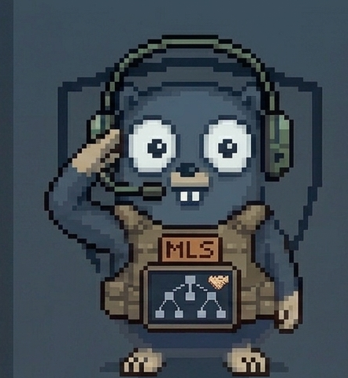
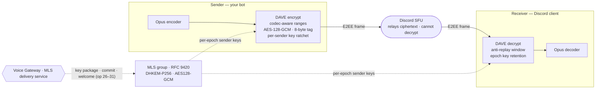

<p align="center">
  
</p>

<h1 align="center">dave-go</h1>

<p align="center">
  <a href="https://github.com/thomas-vilte/dave-go/releases"></a>
  <a href="https://github.com/thomas-vilte/dave-go/blob/main/LICENSE"></a>
  <a href="https://pkg.go.dev/github.com/thomas-vilte/dave-go"></a>
  <a href="https://github.com/thomas-vilte/dave-go/actions/workflows/go.yml"></a>
</p>

`dave-go` is a pure Go implementation of Discord's DAVE protocol — their end-to-end
encryption for voice and video. It plugs into the
[`github.com/disgoorg/godave.Session`](https://github.com/disgoorg/godave) interface, so a
[`disgo`](https://github.com/disgoorg/disgo) bot can join an E2EE voice channel and have its
audio encrypted end to end. Discord's SFU and gateway only ever see ciphertext.

I started this while trying to get the MLS pieces DAVE needs working in pure Go, and it grew
into a full implementation. It's built on top of
[`github.com/thomas-vilte/mls-go`](https://github.com/thomas-vilte/mls-go), a pure Go
[RFC 9420](https://www.rfc-editor.org/rfc/rfc9420.html) library I also wrote.

For now I'm focused on audio (Opus), which is what I actually use it for — voice/music bots.
Video is intentionally out of scope; more on that below.

## How it works



The voice gateway acts as the MLS delivery service. When people join or leave, that drives
MLS commits that move the group to a new epoch, and each epoch derives fresh per-sender
keys. The media itself is encrypted with AES-128-GCM, and the SFU just relays the ciphertext
without being able to read it. `dave-go` handles the whole handshake — key packages,
proposals, commits, welcomes, transitions, sole-member resets and downgrades — behind the
`godave.Session` callbacks, so you don't have to think about any of it.

## Install

```bash
go get github.com/thomas-vilte/dave-go
```

Needs Go 1.26+.

## Usage

Drop it in wherever a `godave.SessionCreateFunc` is expected:

```go
import (
	"github.com/disgoorg/disgo"
	"github.com/disgoorg/disgo/bot"
	"github.com/disgoorg/disgo/voice"
	"github.com/thomas-vilte/dave-go/session"
)

client, _ := disgo.New(token,
	bot.WithVoiceManagerConfigOpts(
		voice.WithDaveSessionCreateFunc(session.New),
	),
)
```

E2EE gets negotiated automatically when the channel supports it. There's a runnable disgo
example in [`examples/voice`](./examples/voice), and one with observability wired up that I
use to check interop against a real Discord client in [`examples/interop`](./examples/interop).

## Observability

If you want to watch the E2EE state, use `session.NewWithReporter` instead. It hands you a
`Reporter` (and a `Closer` so you can tear the session down cleanly when the bot moves
channels or disconnects):

```go
voice.WithDaveSessionCreateFunc(session.NewWithReporter(
	func(r session.Reporter, c session.Closer, _ godave.Callbacks) {
		// r.State()  -> Ready, EpochID, ProtocolVersion, DegradedSince
		// r.Stats()  -> commits, welcomes, replay rejections, downgrades, ...
		// r.EpochAuthenticatorCode(ctx) -> 30-digit out-of-band verification code
		// call c.Close() when you drop the session
		myMetrics.track(r)
	},
))
```

`State` and `Stats` are plain structs. I kept telemetry out of the library on purpose — it
doesn't import OpenTelemetry, Prometheus, or any logging framework — so you can export the
numbers to whatever you use, or ignore them.

## What's implemented

Scope is audio. As far as I can tell, every part of the DAVE protocol that an audio bot
actually exercises is implemented and has tests:

- MLS group key exchange (RFC 9420, ciphersuite `DHKEMP256_AES128GCM_SHA256_P256`)
- per-sender key ratchets, AES-128-GCM with 8-byte truncated tags
- proposal validation — only Add/Remove from the gateway's external sender, only for members
  the session expects
- external-sender check when joining via welcome, plus duplicate-identity and inline-proposal
  checks on commits
- anti-replay, a bounded ratchet advance, and nonce expansion that only commits after a frame
  authenticates
- passthrough handling under active E2EE, sole-member reset, and downgrade to transport-only
- epoch authenticator and displayable codes for out-of-band verification

I've also run it against a real Discord client end to end: the audio plays back, and the
epoch authenticator code the library reports matches the one Discord shows in the call.

Out of scope, on purpose:

- video codecs (VP8/VP9/H264/H265/AV1) — the encoder rejects anything but Opus with
  `ErrCodecNotSupported` rather than silently doing the wrong thing
- identity key verification and persistent signature keys — that's a first-party client
  feature, not something a bot needs

## Security

I've implemented the DAVE spec and RFC 9420 as carefully as I could, and I went through the
protocol's MUSTs one by one and cross-checked them against the code. That said, this has
**not** had a formal third-party security audit — the review so far is my own. Keep that in
mind before relying on it for anything where the stakes are high.

If you find a security issue, please don't open a public issue. Report it privately through
[GitHub security advisories](https://github.com/thomas-vilte/dave-go/security/advisories) so
I can look at it before it's public.

## Packages

- [`session`](https://pkg.go.dev/github.com/thomas-vilte/dave-go/session) — the `godave.Session` implementation, the transition state machine, and the `Reporter`
- [`mediakeys`](https://pkg.go.dev/github.com/thomas-vilte/dave-go/mediakeys) — sender key derivation, ratchets, nonce handling, displayable codes
- [`frame`](https://pkg.go.dev/github.com/thomas-vilte/dave-go/frame) — DAVE frame encrypt/decrypt, AES-GCM with truncated tags, ULEB128, unencrypted ranges
- `codecs` — the codec-aware frame transforms the session layer uses

## Status

It works and I run it in production, but it's still young. The API may still shift and I'm
cleaning up internals as I go. Issues and feedback are welcome.

## References

- [`godave`](https://github.com/disgoorg/godave) — the `Session` interface this implements
- [`mls-go`](https://github.com/thomas-vilte/mls-go) — the underlying RFC 9420 MLS library
- [RFC 9420 — The Messaging Layer Security (MLS) Protocol](https://www.rfc-editor.org/rfc/rfc9420.html)
- [Go package docs](https://pkg.go.dev/github.com/thomas-vilte/dave-go)

## License

Apache 2.0 — see [LICENSE](./LICENSE).
